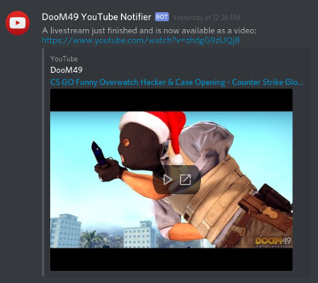

## YouTube upload notification via Discord webhook

**Notifies for:**

- Standard video upload:

- Livestreams starting (option for gaming.youtube.com link, enabled by default):

- Livestreams that have just ended, with a link to watch (option to disable):

Usually is faster than an email from YouTube of the same video

**Requirements:**
- PHP webserver with curl
  * (could easily be converted to some other server/language though)
- Permission for PHP to create a file in the same directory
  * I assumed this was pretty standard, but I ran into it recently so I'm listing it here. After a notification shows in Discord, there should be a `ytnotify.latest` file on the webserver - if not, something is broken.

**Setup:**
- Create a webhook on Discord (edit a text channel > Webhooks > Create Webhook)
- Follow steps 1 - 3 under "Before you start" on https://developers.google.com/youtube/v3/getting-started to create a server API key
- Edit ytnotify.php with a text editor:
  * Change REPLACE_WITH_API_KEY to your server API key created above
  * Change REPLACE_WITH_CHANNEL_ID to your YouTube channel ID (more info: https://developers.google.com/youtube/v3/guides/working_with_channel_ids)
  * Change REPLACE_WITH_UNIQUE_SECRET to your own unique secret - If you aren't sure what to put, grab something from here: https://www.randomlists.com/string
  * Change REPLACE_WITH_WEBHOOK_URL to your Discord webhook URL
- Upload ytnotify.php to a public location on your webserver
- Edit ytnotify_subscribe.sh/php with a text editor:
  * Change REPLACE_WITH_CHANNEL_ID to your YouTube channel ID
  * Change REPLACE_WITH_CALLBACK_URL to the public URL of ytnotify.php (including http[s]://)
  * Change REPLACE_WITH_UNIQUE_SECRET to the same secret set in ytnotify.php

ytnotify_subscribe needs to be run regularly - the subscription times out after a set time (432000 seconds/5 days last I checked).
This is best done with a cronjob on the server - I have mine run at 5am every Monday and Friday.

Since it falls back to notifying when there's no last known publish date, the first notification could be from a title or description change.

**Known issues:**
- Keeping track of the last publish time with a file is probably not the best, and should be changed eventually...
